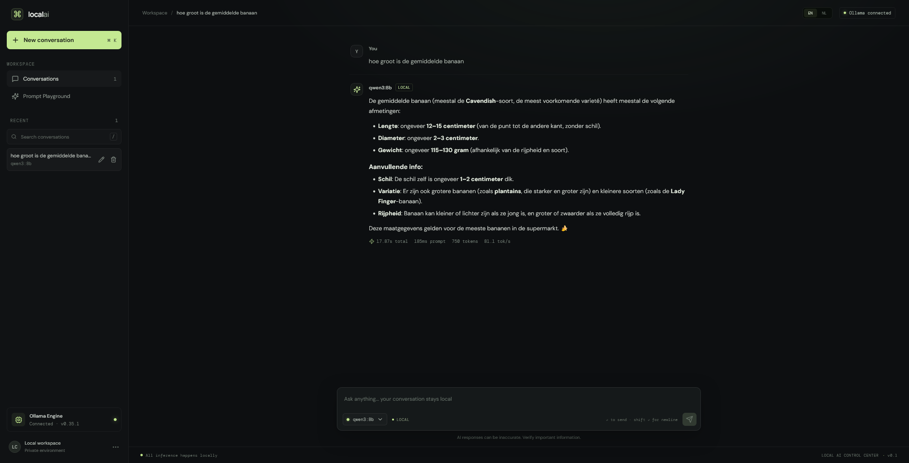
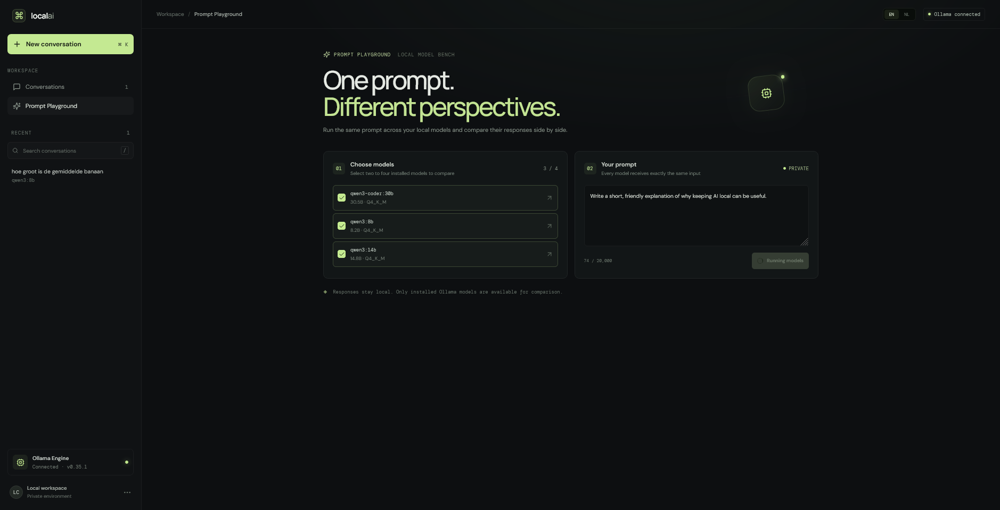
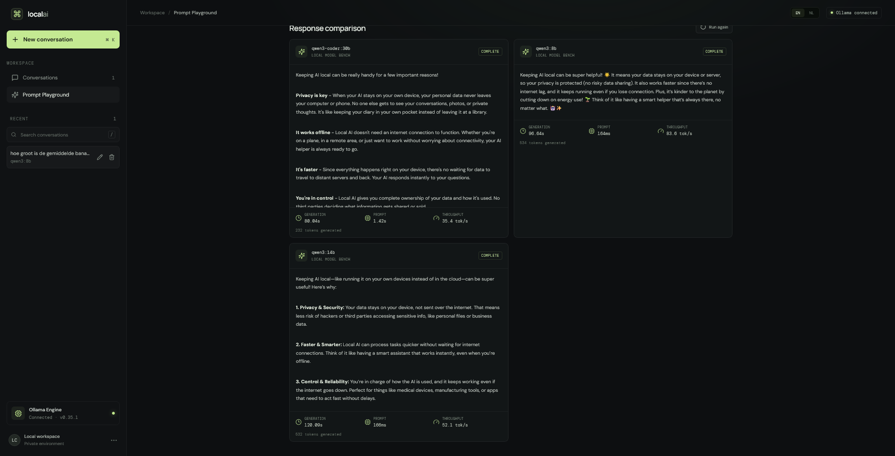
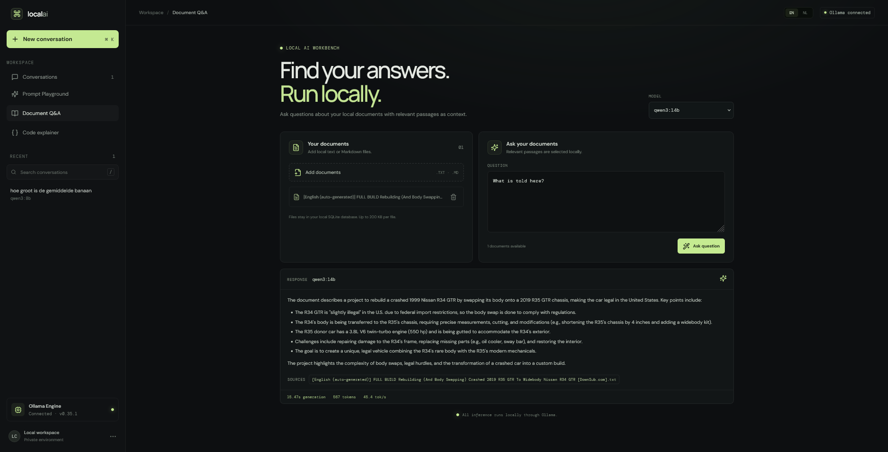
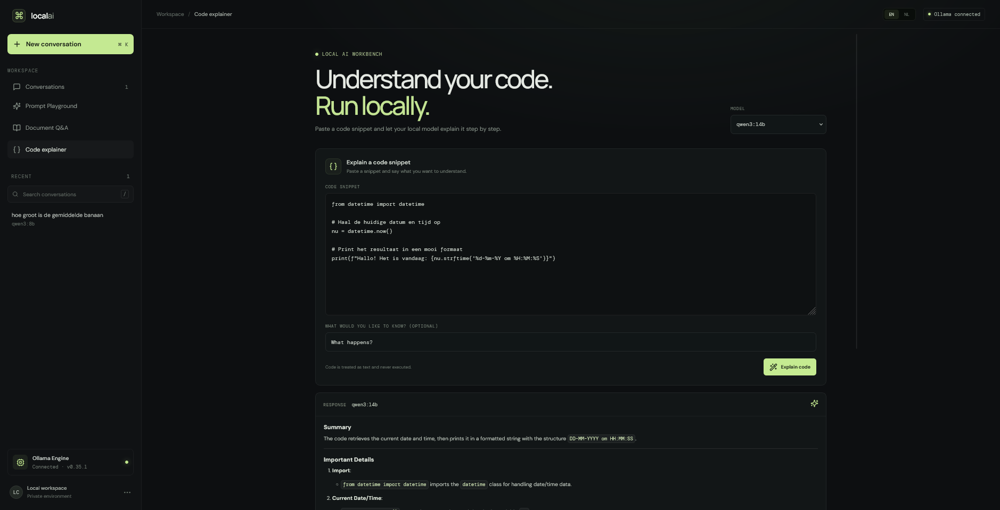
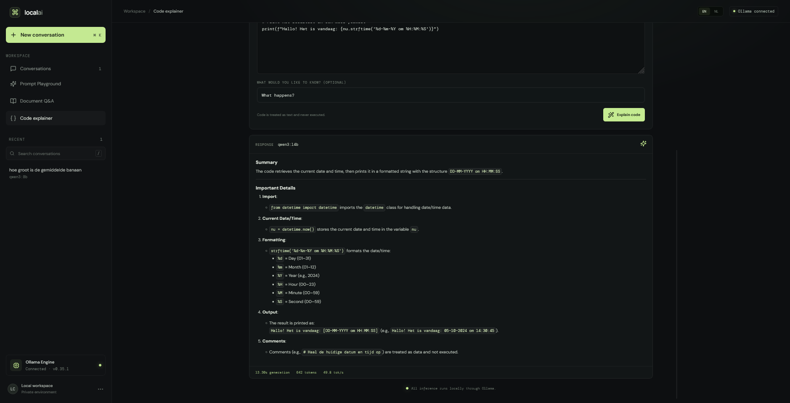
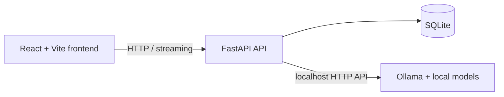

# Local AI Control Center

A private, local-first workspace for chatting with Ollama models and comparing their responses.

> Liever in het Nederlands? Lees de [Nederlandstalige README](README.nl.md).

## What is this?

Local AI Control Center is a locally running dashboard for Ollama. Stream conversations, manage chat history, inspect generation statistics, and compare the same prompt across multiple installed models. The frontend and API run on localhost; conversations and messages are stored in a local SQLite database.

## Features

- Ollama connection and installed-model status
- Streaming chat with conversations and messages persisted in SQLite
- Search, rename, and delete conversations
- Generation time, prompt time, token count, and tokens per second when Ollama provides them
- Prompt Playground for running one prompt across two to four local models in parallel
- AI tools for asking questions about local `.txt` and `.md` documents and getting code explained
- Responsive dark interface with loading, empty, and error states
- English and Dutch interface with the selected language remembered locally
- Markdown formatting for responses, including lists, tables, and code blocks

## Screenshots

<details>
<summary>View application screenshots (6)</summary>

<p><strong>Dashboard</strong><br></p>
<p><strong>Prompt Playground — 1</strong><br></p>
<p><strong>Prompt Playground — 2</strong><br></p>
<p><strong>Document Q&amp;A</strong><br></p>
<p><strong>Code explainer — 1</strong><br></p>
<p><strong>Code explainer — 2</strong><br></p>

</details>

## Tech stack and architecture

| Component | Technology |
| --- | --- |
| Frontend | React, TypeScript, and Vite |
| API | Python and FastAPI |
| Storage | SQLite |
| Local AI | Ollama HTTP API |
| Python environment and dependencies | uv |
| Backend tests | pytest with mocked Ollama requests |



## AI-Assisted Development

This project was developed with extensive use of **ChatGPT and OpenAI Codex** as AI development tools.

I used ChatGPT to help define the project scope, architecture, features, technical decisions, and development approach. **OpenAI Codex was then used as the coding agent to implement and iterate on the application.**

I was responsible for:

- defining the requirements and desired functionality
- making architectural and technical decisions
- directing the implementation through iterative prompts
- testing the application and integrations
- reviewing and correcting the generated implementation
- debugging issues during development
- setting up the Git/GitHub workflow and project documentation

The project is intentionally presented as an example of **AI-assisted software development**, rather than as a claim that all code was written manually without AI assistance.

The goal was to demonstrate that I can use modern AI coding tools effectively to turn an idea into a working application, understand the resulting architecture, test it, and iterate on it.

## Installation

### Requirements

- Python 3.11 or newer
- [uv](https://docs.astral.sh/uv/)
- Node.js 20.19+ or 22.12+
- [Ollama](https://ollama.com/download) installed locally

### 1. Start Ollama and install a model

Ollama normally runs as a background service. If it is not already running, start it in a terminal:

```sh
ollama serve
```

In another terminal, install any model you want to use, for example:

```sh
ollama pull qwen2.5:7b
```

Model downloads are managed by Ollama. The dashboard does not pull or delete models.

### 2. Start the API

Run these commands from the repository root:

```sh
cd backend
uv sync
uv run python -m app
```

The API listens on `127.0.0.1:8000` by default. The SQLite database is created under `backend/data/` the first time the API starts.

### 3. Start the frontend

Open a second terminal from the repository root:

```sh
cd frontend
npm ci
npm run dev
```

Open the local URL printed by Vite (normally <http://127.0.0.1:5173>). The Vite development server proxies `/api` requests to the FastAPI server. If port 5173 is already in use, Vite may choose another port; use the URL printed in the terminal.

## Configuration

Defaults target Ollama at `http://127.0.0.1:11434`, store SQLite data at `backend/data/local-ai-control-center.db`, and bind the API to localhost. Optional API settings use the `LACC_` prefix:

| Variable | Default | Purpose |
| --- | --- | --- |
| `LACC_OLLAMA_BASE_URL` | `http://127.0.0.1:11434` | Ollama HTTP API address |
| `LACC_DATABASE_URL` | `sqlite:///./data/local-ai-control-center.db` | SQLite database path (relative to `backend/`) |
| `LACC_HOST` | `127.0.0.1` | API bind address |
| `LACC_PORT` | `8000` | API port |
| `LACC_REQUEST_TIMEOUT_SECONDS` | `10` | Ollama connection and request timeout; response reads allow up to 5 minutes |

Copy `.env.example` to `.env` in the repository root to customize settings. Start the API from `backend/` so the relative SQLite path resolves to `backend/data/`. The API’s CORS allowlist is restricted to local Vite development origins.

The Vite `/api` proxy targets `http://127.0.0.1:8000` by default. If you run the API on another port, set `VITE_API_TARGET` before starting Vite. For example, in PowerShell:

```powershell
$env:VITE_API_TARGET = 'http://127.0.0.1:18080'
```

## Development and testing

Backend tests use mocked Ollama responses; no Ollama instance needs to be running:

```sh
cd backend
uv run python -m pytest
uv run python -m ruff check app tests
```

Check formatting and build the frontend:

```sh
cd frontend
npm ci
npm run format:check
npm run build
```

## Security and local use

- Keep the API and frontend bound to `127.0.0.1` for local use. Do not expose them to a network without adding authentication and reviewing CORS and access controls.
- The Ollama base URL is configurable for local setups; set it only to an endpoint you trust.
- The API does not provide authentication because it is intended to run locally. Anyone who can access the bound local service can use it.
- Prompts, messages, conversation titles, and added document contents are stored in the local SQLite database. The database is excluded from version control.
- Chat input and prompt size are capped. Ollama requests have bounded timeouts; long generations can still fail or be cancelled.
- Prompt Playground only accepts models reported as installed by the configured Ollama service. It does not download or delete models.
- The document tool stores text in SQLite and selects relevant passages with keyword matching; it is not a semantic search engine.
- Only `.txt` and `.md` files up to 200 KB are accepted. Their contents are sent to the selected local Ollama model when you ask a question.

## Project structure

```text
backend/    FastAPI API, Ollama client, SQLite schema, and pytest tests
            pyproject.toml and uv.lock manage the Python environment
frontend/   React + Vite application
screenshots/ Images displayed in this README
```
