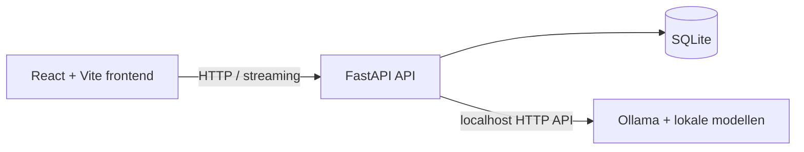

# Local AI Control Center

Een privé, lokale werkruimte om met Ollama-modellen te chatten en hun antwoorden te vergelijken.

> Wil je de Engelse hoofdversie lezen? Bekijk de [English README](README.md).

## Wat is dit?

Local AI Control Center is een lokaal draaiend dashboard voor Ollama. Je kunt gesprekken streamen, eerdere gesprekken beheren, generatiestatistieken bekijken en dezelfde prompt met meerdere geïnstalleerde modellen vergelijken. De frontend en API draaien op localhost; gesprekken en berichten worden opgeslagen in een lokale SQLite-database.

## Functies

- Status van de Ollama-verbinding en geïnstalleerde modellen
- Chatten met streaming, met gesprekken en berichten opgeslagen in SQLite
- Gesprekken zoeken, hernoemen en verwijderen
- Generatieduur, promptduur, aantal tokens en tokens per seconde wanneer Ollama die gegevens levert
- Prompt-speeltuin om één prompt parallel met twee tot vier lokale modellen uit te voeren
- AI-tools: vraag stellen over lokale `.txt`- en `.md`-documenten, en code laten uitleggen
- Responsieve donkere interface met laad-, lege en foutstatussen
- Engelse en Nederlandse interface; de gekozen taal wordt lokaal onthouden
- Markdown-opmaak voor antwoorden, waaronder lijsten, tabellen en codeblokken

## Screenshots

<table>
  <tr>
    <td><strong>Dashboard</strong><br></td>
    <td><strong>Document Q&amp;A</strong><br></td>
  </tr>
  <tr>
    <td><strong>Prompt-speeltuin — 1</strong><br></td>
    <td><strong>Prompt-speeltuin — 2</strong><br></td>
  </tr>
  <tr>
    <td><strong>Code-uitlegger — 1</strong><br></td>
    <td><strong>Code-uitlegger — 2</strong><br></td>
  </tr>
</table>

## Techniek en architectuur

| Onderdeel | Technologie |
| --- | --- |
| Frontend | React, TypeScript en Vite |
| API | Python en FastAPI |
| Opslag | SQLite |
| Lokale AI | Ollama HTTP API |
| Python-omgeving en dependencies | uv |
| Backendtests | pytest; Ollama-verzoeken worden nagebootst |



## AI-ondersteunde ontwikkeling

Dit project is ontwikkeld met uitgebreid gebruik van **ChatGPT en OpenAI Codex** als AI-ontwikkelhulpmiddelen.

Ik heb ChatGPT gebruikt om de projectomvang, architectuur, functies, technische keuzes en ontwikkelaanpak te bepalen. **OpenAI Codex is vervolgens als codeeragent gebruikt om de applicatie te implementeren en stapsgewijs te verbeteren.**

Mijn verantwoordelijkheden waren:

- de vereisten en gewenste functionaliteit definiëren
- architectuur- en techniekkeuzes maken
- de implementatie met iteratieve prompts aansturen
- de applicatie en integraties testen
- de gegenereerde implementatie beoordelen en corrigeren
- problemen tijdens de ontwikkeling opsporen en oplossen
- de Git/GitHub-werkwijze en projectdocumentatie opzetten


## Installatie

### Benodigdheden

- Python 3.11 of nieuwer
- [uv](https://docs.astral.sh/uv/)
- Node.js 20.19+ of 22.12+
- [Ollama](https://ollama.com/download), lokaal geïnstalleerd

### 1. Start Ollama en installeer een model

Ollama draait meestal als achtergrondservice. Start het zo nodig in een terminal:

```sh
ollama serve
```

Installeer in een andere terminal een model, bijvoorbeeld:

```sh
ollama pull qwen2.5:7b
```

Ollama beheert modeldownloads. Het dashboard downloadt of verwijdert geen modellen.

### 2. Start de API

Voer dit uit vanuit de hoofdmap van de repository:

```sh
cd backend
uv sync
uv run python -m app
```

De API luistert standaard op `127.0.0.1:8000`. De SQLite-database wordt bij de eerste start aangemaakt in `backend/data/`.

### 3. Start de frontend

Open een tweede terminal in de hoofdmap:

```sh
cd frontend
npm ci
npm run dev
```

Open de lokale URL die Vite toont, meestal <http://127.0.0.1:5173>. De Vite-ontwikkelserver stuurt `/api`-verzoeken door naar de FastAPI-server. Als poort 5173 bezet is, kiest Vite mogelijk automatisch een andere poort; gebruik dan de URL uit de terminal.

## Configuratie

Standaard gebruikt de app Ollama op `http://127.0.0.1:11434`, slaat SQLite-gegevens op in `backend/data/local-ai-control-center.db` en bindt de API aan localhost. Optionele API-instellingen gebruiken het voorvoegsel `LACC_`:

| Variabele | Standaardwaarde | Doel |
| --- | --- | --- |
| `LACC_OLLAMA_BASE_URL` | `http://127.0.0.1:11434` | Adres van de Ollama HTTP-API |
| `LACC_DATABASE_URL` | `sqlite:///./data/local-ai-control-center.db` | Pad naar de SQLite-database (relatief aan `backend/`) |
| `LACC_HOST` | `127.0.0.1` | Bindadres van de API |
| `LACC_PORT` | `8000` | API-poort |
| `LACC_REQUEST_TIMEOUT_SECONDS` | `10` | Time-out voor verbindingen en verzoeken aan Ollama; het lezen van antwoorden mag maximaal 5 minuten duren |

Kopieer `.env.example` naar `.env` in de hoofdmap om instellingen aan te passen. Start de API vanuit `backend/`, zodat het relatieve pad naar de database uitkomt op `backend/data/`. De CORS-toestaanlijst van de API is beperkt tot lokale Vite-ontwikkeladressen.

De Vite-proxy voor `/api` gebruikt standaard `http://127.0.0.1:8000`. Draait de API op een andere poort, stel dan `VITE_API_TARGET` in voordat je Vite start. Bijvoorbeeld in PowerShell:

```powershell
$env:VITE_API_TARGET = 'http://127.0.0.1:18080'
```

## Ontwikkelen en testen

De backendtests gebruiken nagebootste Ollama-antwoorden; er hoeft geen Ollama-instantie actief te zijn:

```sh
cd backend
uv run python -m pytest
uv run python -m ruff check app tests
```

Controleer en bouw de frontend:

```sh
cd frontend
npm ci
npm run format:check
npm run build
```

## Beveiliging en lokaal gebruik

- Houd de API en frontend voor lokaal gebruik gebonden aan `127.0.0.1`. Stel ze niet bloot aan een netwerk zonder eerst authenticatie toe te voegen en CORS en toegangsbeheer te controleren.
- Het Ollama-adres is instelbaar voor lokale configuraties; gebruik alleen een endpoint dat je vertrouwt.
- De API heeft geen authenticatie, omdat deze bedoeld is voor lokaal gebruik. Iedereen met toegang tot de lokale service kan die gebruiken.
- Prompts, berichten, gesprekstitels en toegevoegde documentinhoud worden opgeslagen in de lokale SQLite-database. De database wordt uitgesloten van versiebeheer.
- De lengte van chatinvoer en prompts is begrensd. Verzoeken aan Ollama hebben time-outs; lange generaties kunnen alsnog mislukken of worden geannuleerd.
- De Prompt-speeltuin accepteert alleen modellen die door de ingestelde Ollama-service als geïnstalleerd worden gemeld. Modellen worden niet gedownload of verwijderd.
- De documentzoeker bewaart tekstbestanden in SQLite en selecteert eenvoudige relevante passages op basis van trefwoorden; het is geen semantische zoekmachine.
- Alleen `.txt`- en `.md`-bestanden tot 200 KB zijn toegestaan. Hun inhoud wordt meegestuurd naar het geselecteerde lokale Ollama-model wanneer je een vraag stelt.

## Projectstructuur

```text
backend/    FastAPI-API, Ollama-client, SQLite-schema en pytest-tests
            pyproject.toml en uv.lock beheren de Python-omgeving
frontend/   React- en Vite-applicatie
screenshots/ Afbeeldingen die in deze README worden getoond
```
